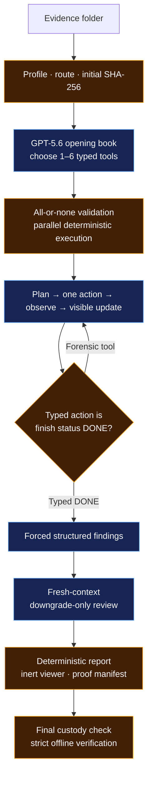

<p align="center">
  
</p>

<p align="center">
  <a href="LICENSE"></a>
  
  
  
  
  
</p>

<p align="center">
  <strong>Unchained reasoning. Chained evidence.</strong>
</p>

<p align="center">
  A bounded autonomous DFIR investigator: model judgment where it helps,
  deterministic authority everywhere evidence can change.
</p>

<p align="center">
  <a href="docs/START-HERE.md"><strong>Start here</strong></a> ·
  <a href="#quickstart">Quickstart</a> ·
  <a href="#what-you-will-see">Run experience</a> ·
  <a href="#how-it-works">Architecture</a> ·
  <a href="#proof-status">Proof status</a> ·
  <a href="JUDGE-QUICKSTART.md">Judge guide</a>
</p>

Unchained profiles an evidence folder, lets GPT-5.6 choose eligible read-only
typed tools, executes the opening in parallel, and follows with one auditable
action per adaptive turn. It then binds findings to exact retained output
bytes, asks a fresh-context reviewer to preserve or downgrade them, and seals a
deterministic report, inert viewer, custody receipts, and manifest into one
content-addressed proof bundle.

> **What “proves” means here:** code verifies what ran, what bytes were retained,
> what exact text was cited, and whether custody still matches. It does **not**
> prove that a model's forensic interpretation is true. A human analyst still
> owns that judgment.

> **New analyst? Start with one safe command:** `sentinel onboard`
>
> It opens the welcome without evidence, a key, or an OpenAI call. Add one
> evidence folder to get a local SHA-256 case card. A paid Sol run requires
> `--launch` **and** the exact interactive phrase `LAUNCH GPT-5.6 SOL`.
> Follow the card-by-card [first-case guide](docs/START-HERE.md).

## Current release status

| Capability | State |
|---|---|
| OpenAI-native controller and independent offline verifier | ✅ Verified offline |
| Linux/AMD64 Docker build, 274-test gate, CLI, profile, and custody | ✅ Verified locally |
| Cheap GPT-5.6 Luna typed-tool canary | ✅ Demonstrated live; independent-reviewer-attested sanitized receipt |
| Authentic GPT-5.6 Sol capped opening on real Windows memory | ✅ Retained bundle verifies `VALID`; terminal state is intentionally `PARTIAL` |
| Authentic `COMPLETE` GPT-5.6 Sol evidence bundle | ⏳ Opening/tool path proven; findings → reviewer → final report still pending |
| Same-evidence speed/cost/accuracy comparison with Qwen | ⏳ Fail-closed comparison scaffold ready; fact set, freeze lock, and measurements pending |

**Live milestone:** the first retained Sol run used a 2 GiB Windows memory image,
recorded `gpt-5.6-sol` on both model responses, executed all six model-selected
opening tools successfully, and stopped honestly when the next reservation
would exceed the six-tool cap. It used 59,254 provider-reported tokens, took
43.702 seconds end to end, and produced a local cost estimate of $0.38789875.
This proves the live opening, typed execution, cap, custody, and bundle path—not
a completed investigation. See the
[release handoff](docs/OPENAI_VNEXT_RELEASE_HANDOFF.md) for the full scorecard
and fastest submission path.

**Post-rehearsal hardening:** four later unscored attempts exposed a real
terminal-contract problem. Their retained audits show completed responses with
395–1,750 characters of visible ledger text but no typed action—not empty
responses. The v2 controller therefore does not normalize blank text,
punctuation, Markdown, or prose into completion. Every adaptive response must
choose exactly one typed action: one eligible forensic tool or the closed
`finish_investigation` action with the sole argument `status="DONE"`. The
offline verifier understands historical literal-DONE-v1 bundles but requires
the new runtime's typed catalog, `tool_choice=required`, and exact terminal
schema. A live `COMPLETE` v2 bundle remains pending.

## Quickstart

Choose the smallest path that answers your question.

### 1. Recommended: guided, profile-first onboarding

On native Windows, the setup script installs the pinned CPython 3.11
environment and finishes by printing the exact onboarding command. Setup reads
no evidence, asks for no key, and makes no OpenAI call.

```powershell
git clone https://github.com/3sk1nt4n/sentinel-unchained.git
cd sentinel-unchained
powershell -NoProfile -ExecutionPolicy Bypass -File .\setup.ps1

$sentinel = "$env:LOCALAPPDATA\venvs\sentinel-unchained-py311\Scripts\sentinel.exe"
& $sentinel onboard
& $sentinel onboard "C:\Evidence\CASE-A"
```

The second onboarding command profiles exactly one case locally, classifies by
bounded content probes, assigns public evidence IDs, and performs a full
pre/post SHA-256 custody check. It does not need a key or start a paid run.
Archives are not unpacked; unsupported documents are hashed and listed, then
set aside. The current router accepts at most one ready memory image and one
ready disk image per case; same-class multiples fail closed.

When the case card is ready, choose a hard ceiling—not a different model or a
quality promise:

| Choice | Option | Default hard ceilings |
|---|---|---|
| **CAUTIOUS** | `--caps strict` | 20 tools · 100,000 tokens · 10 min · $2.50 estimated cost |
| **FLAGSHIP** | `--caps default` | 60 tools · 400,000 tokens · 30 min · $10 estimated cost |

Both use GPT-5.6 Sol. Environment overrides can change the effective ceilings,
which the case card prints. A paid run starts only with an interactive command
such as the following and the exact phrase `LAUNCH GPT-5.6 SOL`:

```powershell
& $sentinel onboard "C:\Evidence\CASE-A" --launch --caps strict
```

Read the concise [Start Here guide](docs/START-HERE.md) for evidence formats,
mount outcomes, the optional no-evidence Luna canary, cloud boundaries, and the
post-run verify/view steps.

### 2. No key: prove the container and evidence front door work

Requirements: Git and Docker Desktop (or Docker Engine + Compose).

```powershell
git clone https://github.com/3sk1nt4n/sentinel-unchained.git
cd sentinel-unchained
docker compose build
docker compose run --rm offline
docker compose run --rm offline profile /evidence --json
```

The first run command uses the container's friendly `onboard --json` default:
no key, no evidence read, no network, and exit `0`. The last command profiles
the committed synthetic log fixture with **no
network**, **no API key**, and **zero OpenAI calls**. It should report
`logs-only`, public evidence ID `E001`, and matching custody.

`docker compose run --rm offline doctor --json` is an explicit live-readiness
check. It correctly reports not ready when the offline service has no key/model;
that is not the default onboarding result or an installation failure.

To profile your own folder read-only:

```powershell
$env:SENTINEL_EVIDENCE_PATH = "C:\Evidence\CASE-A"
docker compose run --rm offline profile /evidence --json
```

### 3. Cheap live check: one GPT-5.6 Luna request

This canary tests only container → OpenAI authentication, the Responses API,
returned model/request identity, usage accounting, and one forced strict typed
tool call. It reads no evidence and creates no proof bundle.

Put the key in a one-line file outside the repository, then point Compose to
that file:

> Revoke any key that has appeared in chat, logs, screenshots, or recordings.
> Use a fresh project-scoped key with an explicit spend limit for the canary.

```powershell
$env:OPENAI_API_KEY_FILE = "C:\Secure\openai_api_key"
docker compose --profile live run --rm live-smoke
```

The key is mounted as a Docker secret and read through
`OPENAI_API_KEY_FILE`; it is not copied into the image or placed in ordinary
container environment metadata. The command defaults to `gpt-5.6-luna`, one
request, low reasoning, low verbosity, a 128-output-token ceiling, `store=false`,
and no retry layer.

> The result is labeled `NONQUALIFYING_CONNECTIVITY_SMOKE`. It cannot satisfy
> `--require-live-gpt56`, enter the Qwen benchmark, or stand in for a forensic
> run. Luna is used here because OpenAI positions it for efficient,
> high-volume work at lower cost; the proof-compatible investigation remains
> Sol-specific. See OpenAI's [latest-model guide](https://developers.openai.com/api/docs/guides/latest-model)
> and [current pricing](https://developers.openai.com/api/docs/pricing).

The first live canary has now been independently reported as one valid Luna
request with 186 input and 27 output tokens. Because its raw JSON receipt was
not retained with the supplied artifacts, the committed
[Luna receipt](docs/runs/luna-canary-receipt.json) is explicitly an attested
sanitized projection—not bundle-derived cryptographic proof.

<details>
<summary>Linux/macOS secret-file command</summary>

```bash
export OPENAI_API_KEY_FILE=/secure/openai_api_key
docker compose --profile live run --rm live-smoke
```

</details>

### 4. Real investigation: GPT-5.6 Sol proof path

The flagship path is native Windows + CPython 3.11 for Windows memory evidence.
Use an authorized project key and the public `gpt-5.6` alias, which currently
routes to Sol.

```powershell
py -3.11 -m venv C:\venvs\sentinel-unchained
& C:\venvs\sentinel-unchained\Scripts\Activate.ps1
python -m pip install .

$env:UNCHAINED_MODEL = "gpt-5.6"
$env:OPENAI_API_KEY = "<set locally; never paste or commit it>"

sentinel doctor
sentinel onboard C:\Evidence\CASE-A
sentinel onboard C:\Evidence\CASE-A --launch --caps strict
```

At completion, the CLI prints the exact next `verify` and `view` commands.
The onboarding path requires the exact interactive paid-launch phrase. Advanced
automation may still invoke `sentinel run` directly when authorization is
established outside the CLI.

The live Sol opening/tool route is now demonstrated on real memory. Before the
flagship `COMPLETE` run, use a harmless case to exercise the still-pending live
typed `finish_investigation({"status":"DONE"})` → serializer → reviewer →
final-report phases under the intended submission caps.

## What you will see

1. **Case card** — evidence is classified by bounded content probes, assigned
   public IDs, routed by OS/shape, and SHA-256 hashed before any model call.
2. **Opening book** — GPT-5.6 chooses one to six eligible typed tools. Code
   validates the complete decision and starts valid calls concurrently.
3. **Visible investigation** — each adaptive turn is
   `PLAN → one ACT → OBSERVE → UPDATE`; growing provider transcripts are not
   replayed.
4. **Grounded review** — exact quotes become content-addressed UTF-8 byte spans;
   a fresh-context reviewer may preserve or downgrade, never upgrade.
5. **Proof handoff** — Unchained prints the bundle path, terminal status, and
   exact verification/viewer commands.

The model never receives a shell, local evidence path, executable name,
subprocess authority, or budget authority. Fixed private workers may invoke
allowlisted forensic operations; the model cannot construct those commands.

## What you get

Every finalized run lives under
`unchained-runs/<UTC-timestamp>-<id>/` outside the evidence tree.

| Artifact | Plain-English purpose |
|---|---|
| `viewer.html` | Self-contained, no-JavaScript proof viewer; no server required |
| `report.md` | Human-readable report with deterministic finding rows and citations |
| `audit.jsonl` | Ordered, hash-chained lifecycle receipts |
| `tool-outputs/` | Exact sanitized outputs cited by findings |
| `profile.json` | Evidence inventory, route, readiness, and capability label |
| `environment.json` | Allowlisted runtime, dependency, model, prompt, catalog, and cap facts |
| `summary.json` | Audit-derived status, usage, finding, receipt, and custody counters |
| `manifest.json` + `manifest.sha256` | Content-addressed bundle inventory and detached checksum |

```powershell
sentinel view C:\path\to\bundle
```

`view` verifies the bundle before opening it. A bundle claiming `COMPLETE`
automatically receives strict lifecycle verification first.

## Why Unchained is different

| Layer | Authority |
|---|---|
| GPT-5.6 investigator | Chooses bounded strategy, updates the visible ledger, interprets retained observations, proposes findings |
| Deterministic controller | Routes evidence, validates typed calls, enforces caps, executes tools, hashes custody, resolves exact spans |
| Fresh-context reviewer | Preserves or downgrades existing findings; cannot create or upgrade them |
| Deterministic renderer | Owns authoritative finding rows, transitions, citations, status, report, and viewer |
| Offline verifier | Reconstructs phase inputs, receipts, spans, costs, report, viewer, custody, and terminal state |
| Human analyst | Decides whether the interpretation is correct and what action to take |

That separation is the product: **GPT-5.6 decides where to look; deterministic
code controls what is legal and proves what the system actually retained and
cited.**

## How it works



- **Blue:** GPT-5.6 judgment inside a bounded protocol.
- **Amber:** deterministic code authority and proof reconstruction.

Read the full [architecture](docs/ARCHITECTURE.md) or the detailed
[OpenAI vNext review](docs/OPENAI_VNEXT_REVIEW.md).

## Proof status

| Claim | Current evidence |
|---|---|
| Deterministic profile, routing, public IDs, and pre/post custody | Unit/adversarial tests + containerized synthetic profile |
| One-to-six all-or-none parallel opening | Controller and synchronization-barrier regression tests |
| Stateless one-action adaptive loop and typed `DONE` | Required-action, closed-schema, malformed-status, exact-input, and protocol-mutation tests; literal v1 remains verifier-readable only |
| Exact evidence spans | Full-artifact late-span and byte-mutation tests |
| Downgrade-only fresh review | Finding-ID, status-lattice, span, and receipt tests |
| Deterministic report and inert viewer | Independent rerender + exact-byte and positive HTML/CSP policy tests |
| Independent strict verifier | Re-chained adversarial mutations across lifecycle, usage, retry, cost, and custody |
| Linux Docker packaging | CPython 3.11 test target: 274 tests, Ruff, format, and `pip check`; non-root runtime/profile gate |
| Live GPT-5.6 Luna canary | Independently demonstrated; [attested sanitized projection](docs/runs/luna-canary-receipt.json), with no raw receipt available for bundle proof |
| Authentic GPT-5.6 Sol opening on real memory | [Bundle-derived sanitized receipt](docs/runs/sol-capped-dc01-opening.json): 2 model responses, 6 successful opening tools, recorded custody match, offline `VALID` |
| Authentic complete GPT-5.6 Sol case | Pending; retained Sol run is explicitly `PARTIAL` at `MAX_TOOL_CALLS` |
| Faster/better than Qwen | Architectural thesis only until the frozen benchmark is run |

The verifier establishes local protocol and bundle consistency. It does not
cryptographically authenticate OpenAI, replace semantic accuracy scoring, or
turn a same-family reviewer into external ground truth.

## Inspect a proof bundle without a key

```powershell
sentinel verify C:\path\to\bundle --require-complete --require-live-gpt56
sentinel view C:\path\to\bundle
```

Strict verification does more than recompute manifest hashes:

- it reconstructs every model-visible phase packet and typed-call contract;
- it resolves finding quotes against retained artifacts and exact UTF-8 ranges;
- it recomputes usage, local cost estimates, lifecycle counts, and custody;
- it rebuilds `report.md` and `viewer.html` and requires byte-for-byte equality.

Offline consistency is not provider authenticity. Preserve provider-side logs
and externally anchor the final checksum if that threat model matters.

## Supported paths

| Evidence / host route | Status |
|---|---|
| Windows memory image on native Windows | Live Sol opening and six typed tools demonstrated; `COMPLETE` findings/review/report case pending |
| Raw memory image in the safe Linux container | Supported by Volatility; case-specific symbols/readiness still apply |
| Raw disk image with Sleuth Kit in the safe container | Unprivileged raw inspection available |
| Mounted E01/NTFS/APFS inside Docker | Not enabled; would require elevated device/FUSE authority |
| Windows disk/E01 on a properly configured native host | Implemented; authentic vNext route pending |
| Linux evidence | Experimental |
| macOS evidence | Best effort |
| Logs-only folder | Profile/custody smoke only; not a complete investigation route |
| Two ready memory images or two ready disk images | Fails closed; split them into separate cases |

Evidence capability is route-specific. “Docker runs on this laptop” is not the
same claim as “every forensic image type is fully supported on this host.”

## Docker safety boundary

The default Compose service is intentionally conservative:

- non-root UID/GID `10001:10001`;
- read-only root filesystem and read-only evidence bind;
- all Linux capabilities dropped;
- `no-new-privileges` and bounded process count;
- no Docker socket, host PID namespace, or privileged mode;
- no network for the offline service;
- Git exists only in the networked builder, not the final runtime;
- `sleuthkit`, Volatility, CA certificates, and Tini in the runtime.

The live canary necessarily has outbound network access. Safe Docker mode does
not mount filesystems: E01/FUSE/loop-device support would weaken isolation and
is deliberately outside this default.

For multi-gigabyte evidence on Docker Desktop, use a local non-OneDrive path or
WSL2 ext4 storage. A cloud-synced bind can dominate runtime.

## CLI at a glance

```text
sentinel onboard [<evidence>] [--mount] [--json]
sentinel onboard <evidence> --launch --caps strict
sentinel doctor
sentinel profile <evidence> --json
sentinel smoke-openai --json
sentinel run <evidence> --caps strict
sentinel verify <bundle> --require-complete --require-live-gpt56
sentinel view <bundle>
```

| Exit | Meaning |
|---:|---|
| `0` | Command completed within its policy; not an accuracy guarantee |
| `1` | Fatal runtime, provider, verification, or custody failure |
| `2` | Invalid input or configuration |
| `3` | `PARTIAL`: a cap or mandatory phase failed safely |

## Troubleshooting

| Symptom | What to do |
|---|---|
| `doctor` says model/key missing | Set `UNCHAINED_MODEL=gpt-5.6` and either `OPENAI_API_KEY` or `OPENAI_API_KEY_FILE` |
| Docker `doctor` exits `2` with no key | Expected for the offline/no-secret service; use `profile` or `--help` for the no-key gate |
| Luna smoke cannot find its secret | Set host `OPENAI_API_KEY_FILE` to a readable one-line file and add `--profile live` |
| Profile says mount unavailable | Use raw inspection or a properly configured native forensic host; do not add `--privileged` casually |
| Multiple same-class images fail | Put each ready memory/disk image in a separate case folder |
| `view` cannot open from Docker | Verify in the container, then open the bind-mounted `viewer.html` on the host |
| A run is `PARTIAL` | Read `summary.json`, `report.md`, and the last audit events; do not relabel it complete |

## Honest limits

- A real Sol evidence bundle now proves the live opening/tool/cap/custody path,
  but it is `PARTIAL`; no authentic `COMPLETE` GPT-5.6 vNext bundle is published
  yet.
- The Luna receipt is an independent-reviewer attestation because its raw JSON
  response was not retained; it is not bundle-derived proof.
- No frozen same-evidence Qwen latency/cost/accuracy benchmark is published yet.
- Exact receipts establish execution and citation support, not forensic truth.
- The fresh reviewer is a same-family model call, not independent ground truth.
- Private worker containment and process-tree cleanup are not a complete OS sandbox.
- SHA-256 pre/post checks do not defeat every privileged concurrent pathname race.
- A privileged actor who can rewrite and reseal the whole local bundle is outside
  the current trust boundary; signed/timestamped external anchoring is future work.

## Documentation map

| Read this | When |
|---|---|
| [Start Here](docs/START-HERE.md) | First install, first case card, safe launch choice, and verify/view handoff |
| [Judge quickstart](JUDGE-QUICKSTART.md) | First judge walkthrough or native setup |
| [OpenAI vNext release handoff](docs/OPENAI_VNEXT_RELEASE_HANDOFF.md) | Completed jobs, comparison, Docker gate, winning story, demo, and next actions |
| [Architecture](docs/ARCHITECTURE.md) | Trust boundary and lifecycle design |
| [OpenAI vNext review](docs/OPENAI_VNEXT_REVIEW.md) | Baseline comparison and defect disposition |
| [Hackathon handover](HACKATHON_HANDOVER.md) | Current proof ledger and execution checklist |
| [Sanitized Sol live receipt](docs/runs/sol-capped-dc01-opening.json) | Bundle-bound `PARTIAL` opening, tool, cap, usage, custody, and verification facts |
| [Attested Luna receipt](docs/runs/luna-canary-receipt.json) | Nonqualifying connectivity result and explicit retention limitation |
| [Winner roadmap](docs/WINNER_ROADMAP.md) | Scoring strategy and benchmark plan |
| [Build provenance](BUILD_PROVENANCE.md) | Submission-period contribution boundary |
| [Decisions](DECISIONS.md) | Detailed protocol and scope decisions |

## Development

Native CPython 3.11 gate:

```powershell
python -m pip check
python -m pytest -q
python -m ruff check .
python -m ruff format --check .
python -m build
```

Clean Linux/AMD64 Docker gate:

```powershell
docker build --target test -t sentinel-unchained:test .
docker build --target runtime -t sentinel-unchained:local .
docker compose run --rm offline profile /evidence --json
```

The package requires CPython `>=3.11,<3.12`. The Qwen reference-tool dependency
is pinned to commit
`9f309c6134e857f7b86f3e6b9c6709ce954944a5`; Docker resolves it only in the
builder and installs the final image from prebuilt wheels.

## Provenance and license

Unchained is an MIT-licensed OpenAI Build Week project by Adil Eskintan.
It was built from the reviewed Unchained baseline while retaining
selected, commit-pinned typed forensic tooling from
[Sentinel Qwen Ensemble](https://github.com/3sk1nt4n/Sentinel-Ensemble-Qwen).

The contribution boundary and preserved pre-event Git provenance are documented
in [BUILD_PROVENANCE.md](BUILD_PROVENANCE.md). Detailed current work, validation,
and remaining claims are in the
[release handoff](docs/OPENAI_VNEXT_RELEASE_HANDOFF.md).

> **Winning line:** Unchained is not an LLM pretending to be evidence. It is
> GPT-5.6 directing a bounded investigation whose actions, citations, custody,
> and final report can be checked independently.
