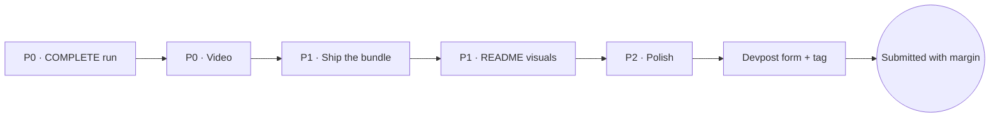

# Final sprint — roadmap to the deadline

> **Deadline: Monday 2026-07-21, 17:00 PT.** This is the execution roadmap
> distilled from the [adversarial judge-panel review](JUDGE-PANEL-REVIEW.md),
> ordered strictly by leverage. Do the phases in order; do not polish P2 items
> while a P0 item is open.

## P0 — existence gates (nothing else matters until these are done)

### 1. One authentic COMPLETE GPT-5.6 Sol run — ~4 h including retries

The single highest-leverage act for every criterion. Known risk: typed-DONE-v2
has never succeeded live (seven PARTIAL attempts retained on 2026-07-19), so:

- [ ] Dry-run the full lifecycle on a small harmless case first (opening →
      adaptive → typed DONE → serializer → reviewer → report → verify).
- [ ] Then the real case under submission caps. Budget 2–3 attempts
      (~$0.50–2 per attempt under CAUTIOUS ceilings).
- [ ] Retain everything; disclose every valid attempt (honesty rails).
- [ ] Gate: `sentinel verify <bundle> --require-complete --require-live-gpt56`
      passes, and `scripts/check_viewer.py` passes on the same bundle.

### 2. The sub-3-minute public YouTube video — ~3 h

The only DQ-level gap. Record against the authentic bundle from step 1.
Storyboard exists in [DEMO-SCRIPT.md](DEMO-SCRIPT.md); add the panel's killer
beat for the Idea criterion:

- [ ] Open on the thesis line, then the colorful onboarding and launch phrase.
- [ ] Live run: opening book, six typed tools with bytes/timing, status badge.
- [ ] **The 20-second proof moment: flip one byte in the sealed bundle and show
      the verifier fail, then restore and show VALID.**
- [ ] Audio names Codex and GPT-5.6 explicitly; Codex Session ID on screen.
- [ ] Under 3:00, public visibility, link committed into README + SUBMISSION.

## P1 — make the work visible (~4 h total)

### 3. Ship a judge-verifiable proof bundle — ~2 h
- [ ] Commit a sanitized COMPLETE bundle (viewer.html + receipts) under
      `docs/runs/` or a GitHub release, or host viewer.html via Pages.
- [ ] Link it in the README first screen: "See a proof bundle right now — no install."
- [ ] Replace the literal `<COMPLETE_BUNDLE>` placeholder in SUBMISSION.md.

### 4. Three visuals at the top of the README — ~2 h
- [ ] Screenshot/GIF: the onboarding welcome card.
- [ ] Screenshot/GIF: live run narration ending in the status badge.
- [ ] Screenshot: viewer.html findings/citations view.
- [ ] Move the two status tables below the Quickstart; the first screen shows
      product, not pending-item ledgers.

## P2 — point defense (~2 h total, only after P0+P1)

- [ ] Add a short "Why not just guardrails, evals, or attestation?" paragraph
      naming the prior-art families and the one-sentence delta for each —
      pre-empts the strongest objection the Idea judge raised.
- [ ] Promote the instant native no-key path above the `docker compose build`
      lane in JUDGE-QUICKSTART (the audit flagged the build lane as tension
      with the no-rebuild rule).
- [ ] Rework demo.ps1 so the no-key demo ends on a positive VALID line instead
      of `DEMO_BUNDLE_VERIFIED_INVALID_INPUT`.
- [ ] Add a 10-line "Who needs this" scenario near the top of the README.
- [ ] Name the reviewer mechanism ("monotonic review") in README and video.

## Submission gates — Monday morning, not Monday afternoon

- [ ] Incognito QA: repo, video, hosted viewer all load logged-out.
- [ ] Devpost form filled from [SUBMISSION.md](SUBMISSION.md); canonical URL is
      `github.com/3sk1nt4n/Unchained` (renamed 2026-07-19).
- [ ] Codex Session ID double-checked on the form and in the README.
- [ ] Final tag pushed; commit/tag/image identity agree.
- [ ] Devpost confirmation screenshot retained.

## Cut list (already decided — do not reopen)

- Same-evidence Qwen benchmark: **cut.** The claims ledger already marks the
  comparison PENDING; a half-shipped benchmark reads worse than none.
- GHCR prebuilt image: nice-to-have, only if all gates above are green.
- Any further documentation polish: past the point of diminishing returns.

## Honesty rails (unchanged, never cross)

No fake or replayed COMPLETE run. Disclose every valid attempt. No
"faster than Qwen," no "independent evaluation," no completed-investigation
claims until each is true. Every published metric carries its numerator,
denominator, and source artifact.
